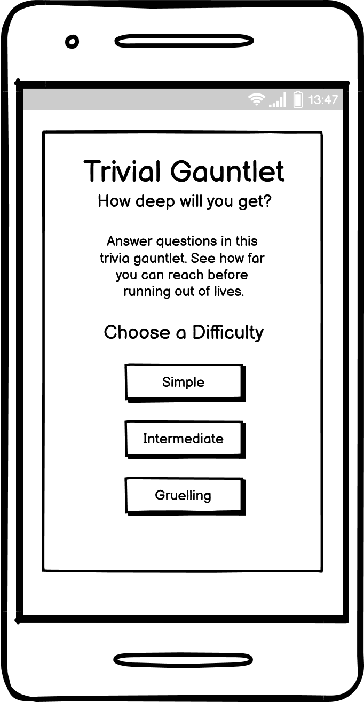
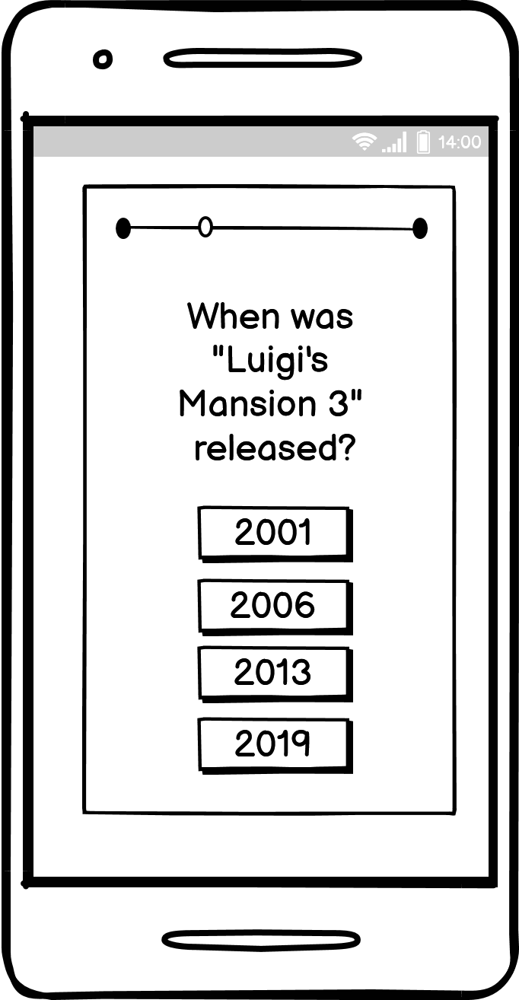
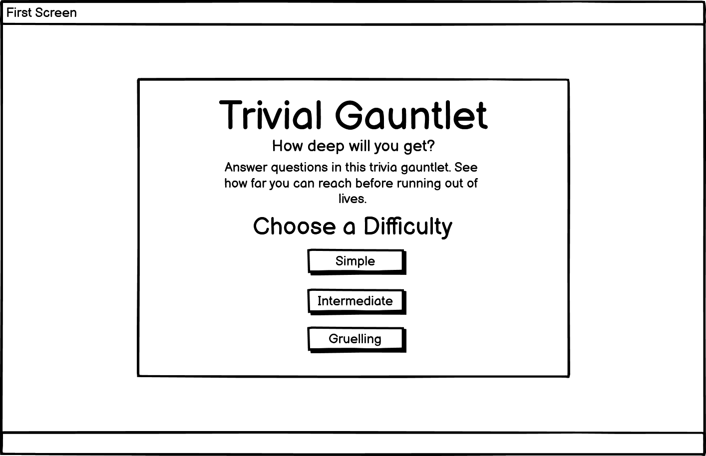
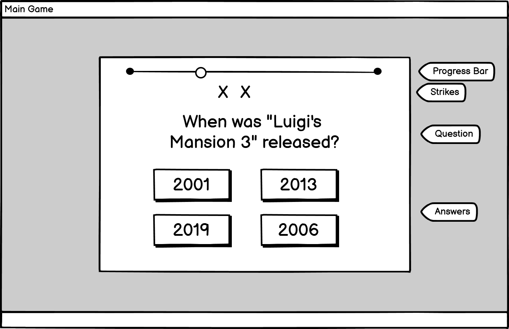

# Trivial Gauntlet #
Tackle a gauntlet of trivia questions and see how far you can get with limited strikes in this multiple choice quiz. This game uses the [Open Trivia Database](https://opentdb.com/) API to generate a gauntlet of questions to challenge the users' knowledge on various subjects. 

The game is set to an ancient Central American empire gauntlet style background inspired by more physical gauntlet challenges from TV such as Legends of the Hidden Temple and The Crystal Maze. There is also humour in treating the gauntlet as something serious and arduous while having the word trivial in the title.

** Responsive Image **

## Design Choices ##
### Concept ###
As mentioned above this game is designed around to style of older gauntlet type TV gameshows. This informed much of the decisions around font, color, imagery and also layout and game design in order to capture the tone of those shows.

### Layout ###
When designing the layout the primary goals were to stick to the aesthetic for consistency and a strong identity while also keeping it very clear and readable. As such there is very little in the way of filler text.

As the page loads the player is immediately given a concise rundown of the games basic rules and is presented the choice of difficulty which then launches the player straight into the game with no extra page loads.

On the game page the player is provided with only the information needed to complete the task required with no extra steps to keep the game simple and clear. They get the question and the multiple choice answers. The only other information needed is the number of strikes they have which allows them to see whether they can risk guessing without losing the game or not. The inclusion of a progress bar was inspired by the death screen of the video game [Cuphead](https://preview.redd.it/10d3dy3nj8801.png?width=640&crop=smart&auto=webp&s=6f2c6a7f461d41b401aaea2f5f860bf4353c9873). In this game when you die you see how far away from the end of the level you were, this acts as an incentive to try again while also making the level seem daunting and imposing if the player thinks they've gone very far but has only made it a fraction of the way.

### Wireframes ###
The following are the wireframes used to plan the layout for the games main pages. The mobile and desktop versions will remain largely the same with some elements stacking vertically rather than horizontally on smaller devices. This will be achieved using css flexbox and css grids.
- Mobile Title Page

- Mobile Game Page

- Desktop Title Page

- Desktop Game Page

### Fonts ###

### Colors ###

## Features ##

## Testing ##

## Deployment ##

## Technologies ##

## Credits ##