# Trivial Gauntlet #
Tackle a gauntlet of trivia questions and see how far you can get with limited strikes in this multiple choice quiz. This game uses the [Open Trivia Database](https://opentdb.com/) API to generate a gauntlet of questions to challenge the users' knowledge on various subjects. 

The game is set to an ancient Central American empire gauntlet style background inspired by more physical gauntlet challenges from TV such as Legends of the Hidden Temple and The Crystal Maze. There is also humour in treating the gauntlet as something serious and arduous while having the word trivial in the title.

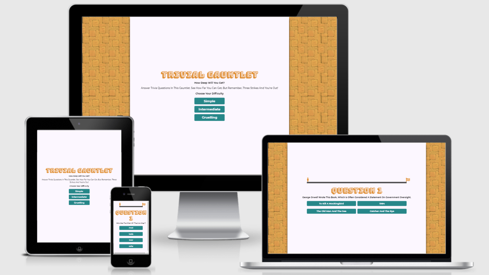

## Design Choices ##
### Concept ###
As mentioned above this game is designed around to style of older gauntlet type TV gameshows. This informed much of the decisions around font, color, imagery and also layout and game design in order to capture the tone of those shows.

### Layout ###
When designing the layout the primary goals were to stick to the aesthetic for consistency and a strong identity while also keeping it very clear and readable. As such there is very little in the way of filler text.

As the page loads the player is immediately given a concise rundown of the games basic rules and is presented the choice of difficulty which then launches the player straight into the game with no extra page loads.

On the game page the player is provided with only the information needed to complete the task required with no extra steps to keep the game simple and clear. They get the question and the multiple choice answers. The only other information needed is the number of strikes they have which allows them to see whether they can risk guessing without losing the game or not. The inclusion of a progress bar was inspired by the death screen of the video game [Cuphead](https://preview.redd.it/10d3dy3nj8801.png?width=640&crop=smart&auto=webp&s=6f2c6a7f461d41b401aaea2f5f860bf4353c9873). In this game when you die you see how far away from the end of the level you were, this acts as an incentive to try again while also making the level seem daunting and imposing if the player thinks they've gone very far but has only made it a fraction of the way.

### Wireframes ###
The following are the wireframes used to plan the layout for the games main pages. The mobile and desktop versions will remain largely the same with some elements stacking vertically rather than horizontally on smaller devices. This will be achieved using css flexbox and css grids.
- Mobile Title Page
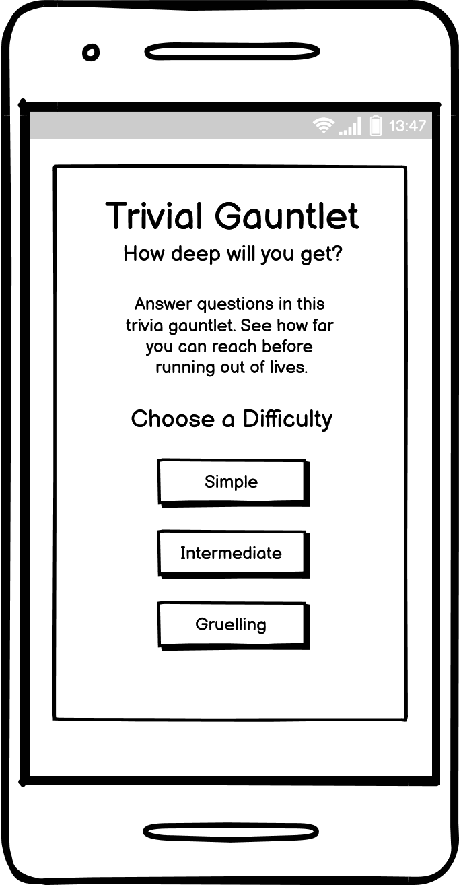

- Mobile Game Page
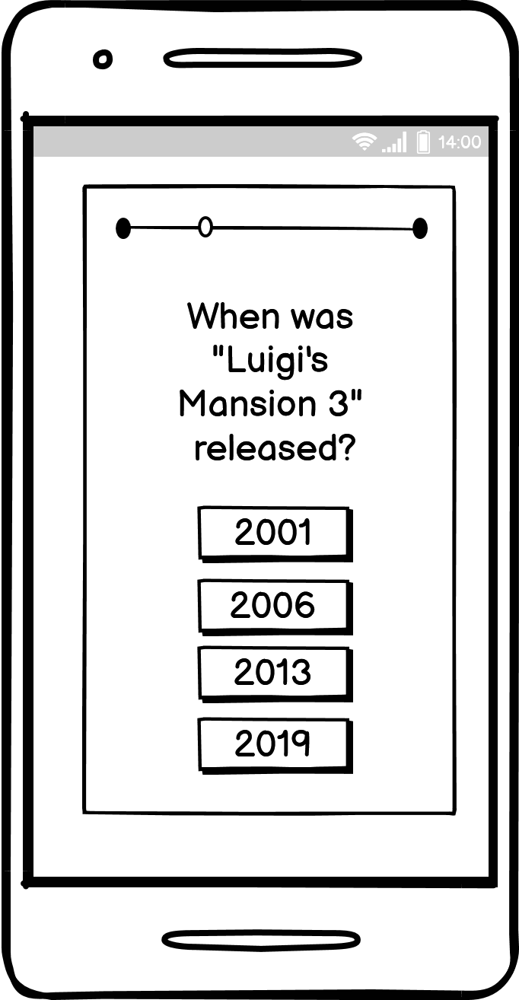

- Desktop Title Page
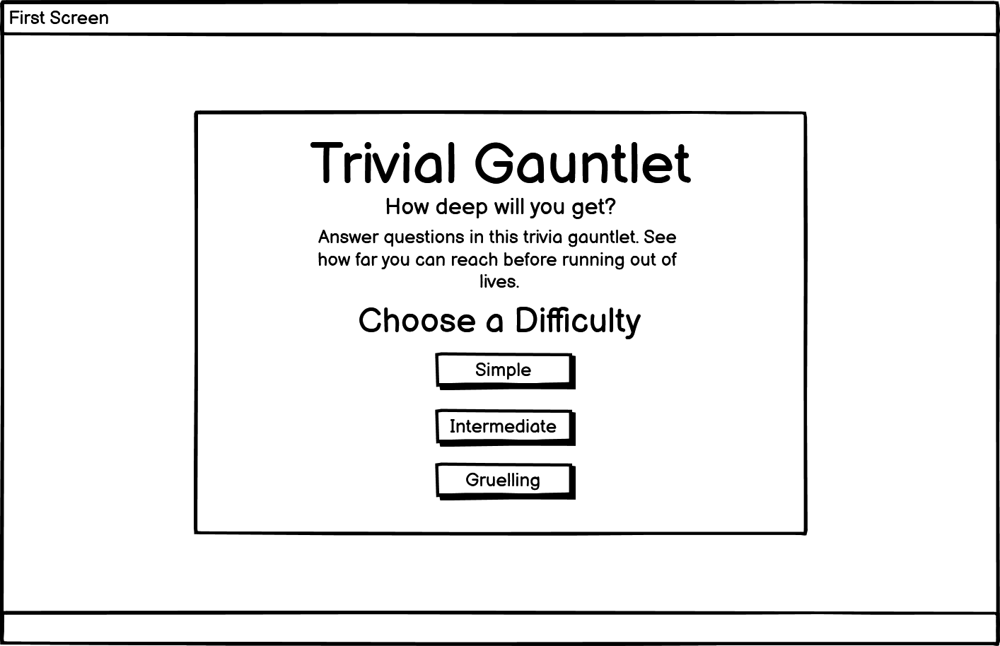

- Desktop Game Page
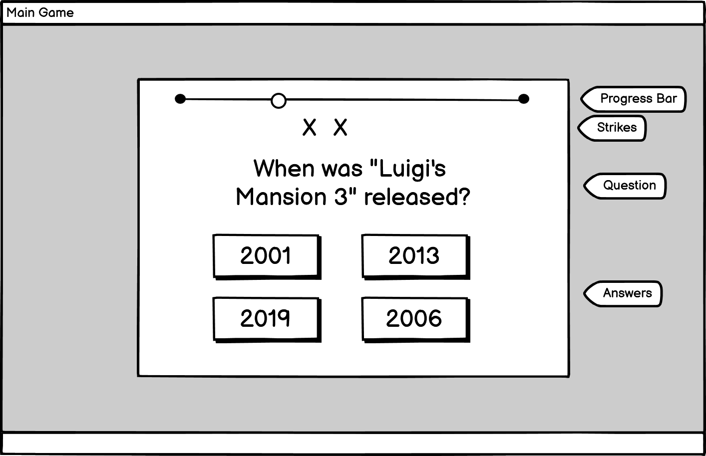

### Fonts ###
All fonts used were found on [Google Fonts](https://fonts.google.com/).

The main hero font used for titles is [Bungee Shade](https://fonts.google.com/specimen/Bungee+Shade). This font is both clear and readable while also being decorative and fitting with the overall aesthetic of the game.

The font chosen for the body elements is [Montserrat](https://fonts.google.com/specimen/Montserrat). This sans-serif font is easy to read, clean yet distinct from default sans-serif fonts. Using a combination of light, medium and bold styles this font meets all needs for the bulk of the games' text.

### Typography ###
Typography icons used for progress bar and strike indicators are found on [Font Awesome](https://fontawesome.com/).

- [Strike Icon](https://fontawesome.com/v5.15/icons/skull?style=solid)
- [Progress Marker Icon](https://fontawesome.com/v5.15/icons/male?style=solid)
- [Finish Line Icon](https://fontawesome.com/v5.15/icons/flag-checkered?style=solid)
### Colors ###
Colors were chosen based on Aztec and Mayan artwork and to common colors associated with them. This meant a combination of yellow, orange and teal. Their shades were chosen to ensure that contrast was high enough to not cause any readability issues. A green and red were then chosen to compliment them while still conveying the idea of answers being correct or incorrect.
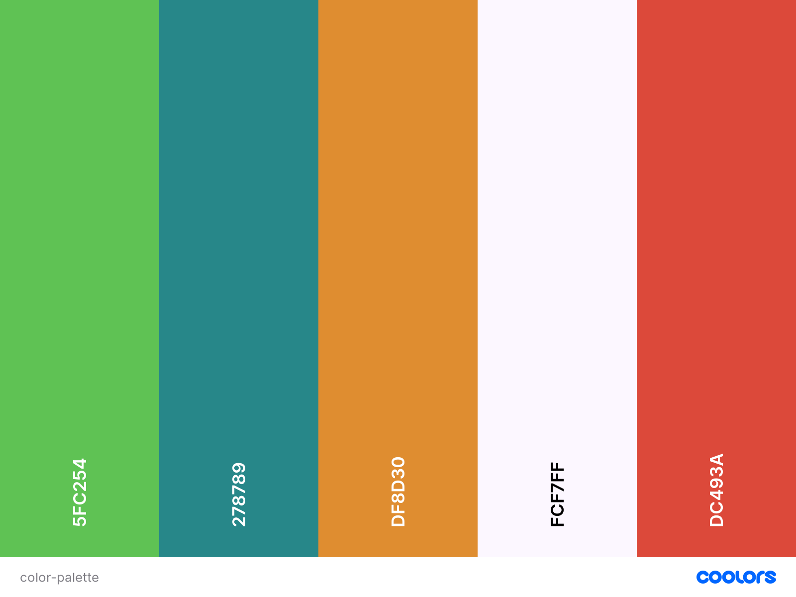
    - Color Palette Created using [Coolors.co](https://coolors.co/)

## Features ##
### Existing Features ###
- Three Difficulty Settings
    - The Player has the option of choosing from 3 difficulty settings which pull from a different pool with the Open Trivia Database. 
    - Upon reloading or restarting, the player can chose their desired difficulty once again.

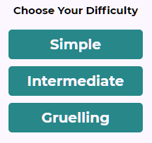

- Session Tokens
    - This game uses OpenTDB's session tokens to cut down on the possibility of the player receiving repeat questions within a single session.

```
async function getToken() {
    let response = await fetch("https://opentdb.com/api_token.php?command=request");
    let token = await response.json();
    return token.token;
}
```

- No Page Loads 
    - All game elements and screens are contained within a single webpage. This means that the player is never required to load any additional pages or data after the initial load.

- Multiple Choice quiz
    - Game fetches 50 questions from the database, all are 4 option, multiple choice questions.
    - Quiz pulls from all possible topics for a wide variety in question content.

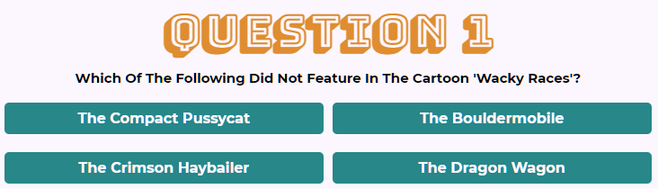

- Interaction Feedback
    - The game provides feedback to the player for every action they take.
    - Players are given an opportunity to see whether their answer was right or wrong before moving on the the next.
    - All buttons have hover effects to show that they are interactable items.

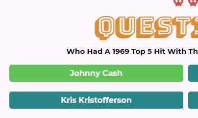

- Progress Bar
    - The game screen contains a progress bar which shows the player their progress through the gauntlet. This serves both as an incentive for the player to try to get as close to the end as they can while also showing just how long and difficult the gauntlet is.

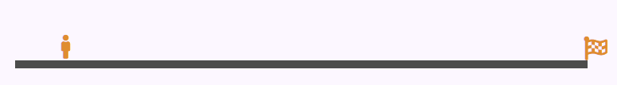

- Three Strike Life System
    - The quiz has a failstate where every time they get and answer wrong they receive a strike and when the strike limit is reached the game is over and the player must restart from the beginning.

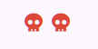

- Database API Question Pool
    - The game pulls from the [Open Trivia Database's](https://opentdb.com/) pool of user submitted and verified questions and answers. The game then parses the data and serves the questions and answers to the user.

### Potential Future Features
- Topic Selections
    - Add additional options screen to allow user to customize quiz more by selecting the topic or length of quiz. Can all be achieved through editing API string based on selections.

- High Scores List
    - Use server side highscores file to save users' progress and display top scores on home or game screen as encentive. Possibly display top three scores on progress bar with extra markers as closer targets to beat.

## Testing ##

Throughout development the game was shared with friends and colleagues in order to search for bugs and any issues related to layout, navigation or overall usability. Their feedback was taken on an ongoing basis and adjustments were made to improve their overall experience. 

This feedback contained suggestions for improving quality of life as well as pointing out bugs such as the ability to click multiple times in a single question. This feedback was used to make improvements to the game on an ongoing basis. I ensured that some of my testers were using apple and some android devices and that some used phones while others also used tablets and desktops in order to ensure all forms were covered in my design.

While I worked on this project through Google Chrome I also loaded the page at various intervals on Mozilla Firefox and Microsoft Edge to ensure there was not major browser specific issues.


### Validator Testing ###
* HTML
    * No errors present when passing through [W3C Validator](https://validator.w3.org/nu/?doc=https%3A%2F%2Fitsalank.github.io%2Ftrivial-gauntlet%2F)
    * Some warnings are present however they relate to empty heading tags which are being populated dynamically by the game.js file
        * *Warning 1* - **Empty heading.** ```<h1 id="question-number" class="heading"></h1>``` Line 45
        * *Warning 2* - **Empty heading.** ```<h3 class="body-text" id="question"></h3>``` Line 46

* CSS
    * No errors present when passing through [Jigsaw Validator](https://jigsaw.w3.org/css-validator/validator?uri=https%3A%2F%2Fitsalank.github.io%2Ftrivial-gauntlet%2F&profile=css3svg&usermedium=all&warning=1&vextwarning=&lang=en)
    * All warnings present relate to global variables set in ```:root {}```

* Javascript
    * No errors present when passing through [JSHint](https://jshint.com/)
    * 8 Warnings present:
        * 4 refer to async functions only available in ES8
        * 2 refer to the use of functions within for loops which do not create any issues
        * 2 refer to the use of an expression in ```function showGameScreen()```
* Lighthouse
    * All metrics above 90 using Chrome DevTools' Lighthouse audit
    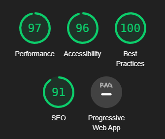

### Bugs ###
Bugs were logged and tracked using GitHub's built in issues system as they were discovered and closed as they were fixed.

* Answer Button was always active even after selecting an answer
    * Solution - Using a variable set to false by default is set to true when the first question loads. Each time an answer is selected this is reset to false until the next question is loaded. Using if statements, answer buttons are only active when ```ready = true```

* Progress bar did not move until the second round of the quiz.
    * Solution - Within loadQuestion() function which controlled incrementing the question index and moving the progress marker `questionIndex++` was below `progressMarkerRef.style.gridColumn = questionIndex;` causing the progress marker to be one round behind all the time.
    ```
        questionIndex++;
        progressMarkerRef.style.gridColumn = questionIndex;
        ready = true;
    ```
* After playing a round and resetting the game the progress marker did not reset until the first question was answered. 
    * Solution - This was fixed by adding the line `progressMarkerRef.style.gridColumn = 1;` to `function reset()`

* Game won alert did not fire after completing the 50th question leading to error state and requiring a refresh to play again.
    * Solution - `gameWon()` was missing an = in `if(questionIndex >= questions.length)` This meant the function did not fire the alert.

## Deployment ##

The site was deployed to GitHub pages. The live site can be found at: [https://itsalank.github.io/trivial-gauntlet/](https://itsalank.github.io/trivial-gauntlet/)

* The process required to deploy the site are:
    * From the site's repository on GitHub, navigate to the settings via the link found in the ribbon menu below the repo name.
    * Select the "pages" section in the sidebar menu to the left of the screen.
    * In the "Source" section, select the branch you wish to use as the source of the site if you have multiple branches/versions. Otherwise select the main branch.
    * Select the root folder and click save.
    * Deployment may take a few seconds or minutes, after which navigate back to the pages section and find the link to the live site highlighted in green.
    * _Alternatively once the page site is deployed on pages you can find a link to the site via the enviroments section to the right of the main repository page._

* To create a local copy of this project:
    * In the terminal type: 
    ```git clone https://github.com/ItsAlanK/trivial-gauntlet.git```
    * This will create a copy of all files on your machine.


## Technologies ##

The main technologies used in this project are:

* [HTML](https://developer.mozilla.org/en-US/docs/Web/HTML): Houses the basic framework for the project.

* [CSS](https://developer.mozilla.org/en-US/docs/Web/CSS): is used for the styling of the site.
    * [CSS Grids](https://developer.mozilla.org/en-US/docs/Web/CSS/CSS_Grid_Layout): is used to control the layout of buttons and progress bar and responsive changes to the game.
    * [CSS Flexbox](https://developer.mozilla.org/en-US/docs/Web/CSS/CSS_Flexible_Box_Layout/Basic_Concepts_of_Flexbox): is used to organize and align the main containers housing the games' screens as well as their text elements.

* [Javascript](https://developer.mozilla.org/en-US/docs/Web/JavaScript): is used for fetching the questions from the database using an API. It also handles all the loading of data to the site and the logic used to run the game.

* [Open Trivia Database](https://opentdb.com/): is the API used to generate the questions for the quiz.

* [JSON](https://developer.mozilla.org/en-US/docs/Web/JavaScript/Reference/Global_Objects/JSON): Is the format in which the questions are received from the API which must then be parsed using
`response.json();`

* [Sweet Alert 2](https://sweetalert2.github.io/): Is used to create the gameover/gamewon alerts as a more stylish alternative to standard browser alerts.


## Credits ##
A big thanks to my Code Institute mentor [Simen Daehlin](https://dehlin.dev/#home) for his help preparing me for this project. And proving valuable feedback and suggestions on how to improve it.

### Design ###

* Color palette created in: [Coolors.co](https://coolors.co/)

* Fonts sourced from: [Google Fonts](https://fonts.google.com/)

* Icons for progress bar and strike markers taken from [Font Awesome](https://fontawesome.com/)

* Background image for desktop found on [myfreetextures.com](https://www.myfreetextures.com/wooden-floor-tiles-pattern-background-texture/)

### Code ###
* [Open Trivia Database](https://opentdb.com/api_config.php) API used to generate questions and answers for quiz

* [Mozilla Dev Site](https://developer.mozilla.org/en-US/docs/Web/JavaScript/Reference/Statements/async_function) used to learn about async functions used when fetching and loading in questions

* [Sweet Alert 2](https://sweetalert2.github.io/) used to display better alerts

* [Fisher-Yates Algorithm](https://en.wikipedia.org/wiki/Fisher%E2%80%93Yates_shuffle#The_modern_algorithm) used to shuffle correct and incorrect answers in their array

* [Code Institute GitPod Template](https://github.com/Code-Institute-Org/gitpod-full-template) tools used to develop this project